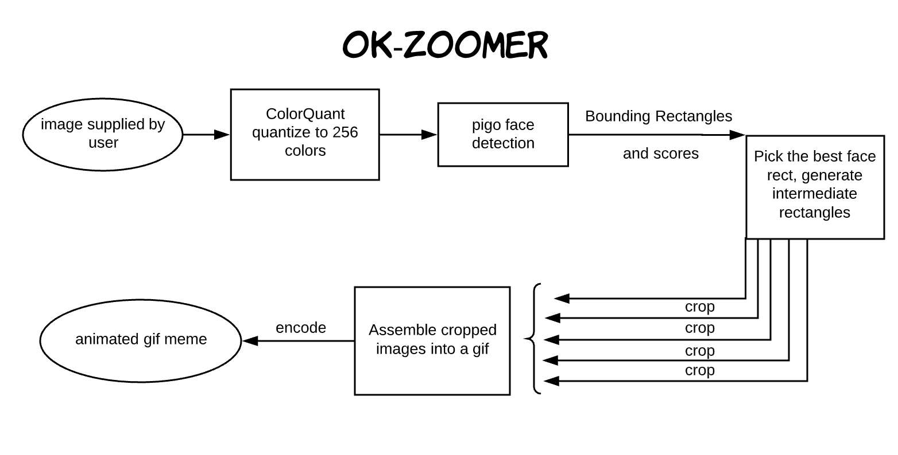

# ok-zoomer
Every GIF is a gift.

## How it works
* face detection with [esimov/pigo](https://github.com/esimov/pigo)
* color quantization / dithering with [esimov/colorquant](https://github.com/esimov/colorquant)
* image resizing with [nfnt/resize](https://github.com/nfnt/resize)
* text message API with [twilio](https://www.twilio.com/)
* hosted on an [AWS EC2 instance](https://aws.amazon.com/ec2/)
* served with [nginx](https://www.nginx.com/)
* SSL with [let's encrypt](https://letsencrypt.org/)

## TODO
* write tests
* port to Go modules
* allow text message-passed parameters like number of frames, delay, and number of faces to detect
* put it on an AWS Lambda to make it more scalable, then release the twilio number into the wild
* 
* add the possibility of rate limiting by using redis to store which gifs were made by which phone numbers, whitelist my own number
* clean up this code, it was my first Go project so the code is pretty sloppy
* less manual deployment and check in nginx + supervisor conf in this repo
